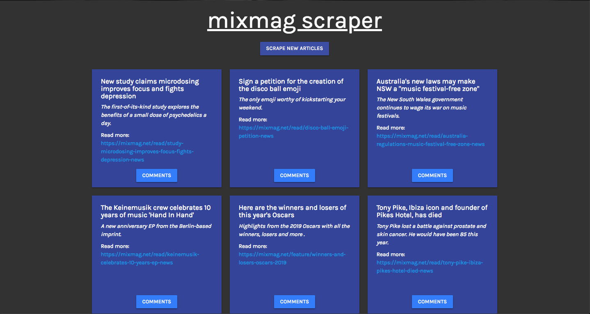

# MIXMAG News Scraper 💿

This is a full-stack app which scrapes the latest news from mixmag.net. It utilizes Node.js, Cheerio, and Axios for data scraping then displays the front-end using the MVC pattern with Mongoose, Handlebars, and Express. Users may also add and delete comments on each article via a modal pop-up.

🚀 Deployed at: http://youve-been-scraped.herokuapp.com/
